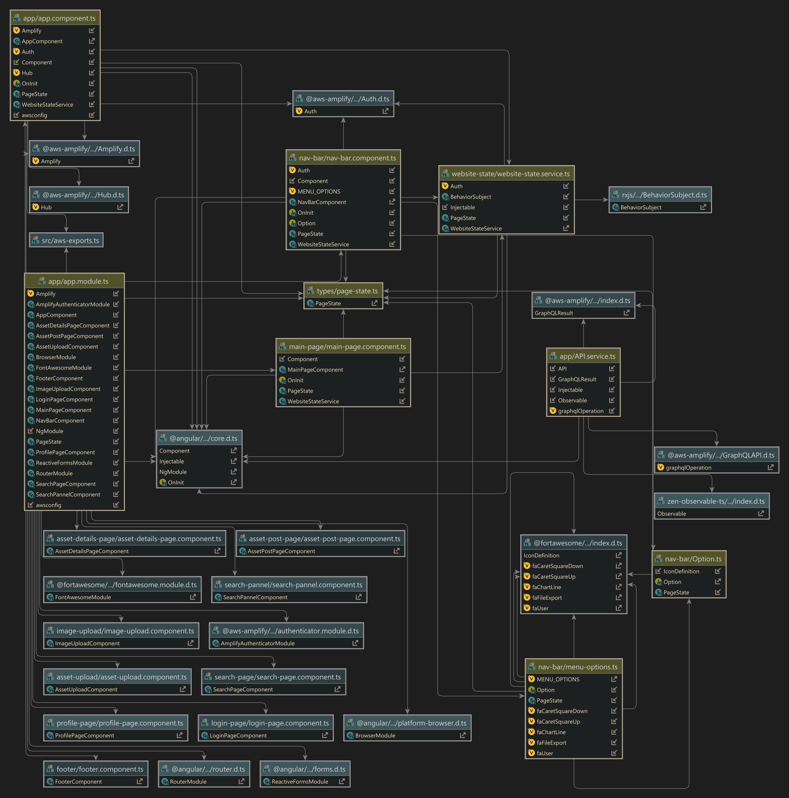

# Celtics Engine Asset Management

## Purpose [WR]
Create a full stack application in which a community of users could easily post, search, view, and upload/download video game asset models

# Entire Project diagram 

# Frontend Demo 

- login page [W] 

	- register and sign in

	- show nav-bar page states while signed-in and out 

- asset post page [JT]

	- post an asset

	- required fields

	- show the asset is now on search page

	- click

- search/explore page [JT]

	- search page html (scaling of the images)

	- look up an asset by name 

	- click an asset to show the route to details page

- asset details [W]

	- download asset

	- remove asset

- profile page [JT]

	- user assets list on profile 

# Backend Demo [WR]

**auth (aws-congnito)**

**data model (dynamodb)**

**navbar (single page application)**

**api (graphql)**

**storage (s3)**

## New Skills/technologies

- angular
- aws amplify
- npm

- typescript
- html/css

## Challenges
- team communication
- transitioning from the java backend to amplify
- git merges / managing the amplify env 
- having a mess of the front-end originally (we cleaned it up though it came out great)

## What you learned
- Learning a new framework or programing language in less then a month can be challenging 